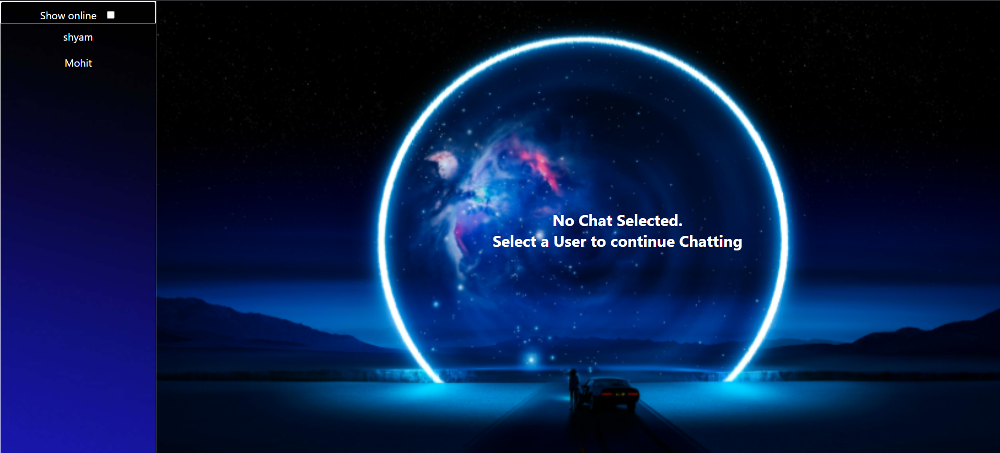

# Project Title
Chat App
##
a real time chat application that allows users to chat with others


## Features

- User authentication (Sign up / Login)
- Real time messaging
- User-friendly UI
- User status (offline/online)


## Tech Stack

**Client:** React, Redux, TailwindCSS, Socket.IO Client, Zustand

**Server:** Node, Express, Socket.IO

**Database:** MongoDB

**Deployment:** Render

## Description
a real time chat application that allows user to sign up, log in and chat withothers instantly using WebSocket technology.

## Screenshots
### Login / Signup


### Home Page


### Home Page with Chat


## Deployment

To deploy this project run

```bash
  git clone https://github.com/aerenyeger/chat-app
```

### 
For Frontend, In terminal

```bash
  cd chat_app
```
```bash
  npm install
```

```bash
  npm run dev
```

### 
For Backend, In new terminal

```bash
  cd bd_chat_app
```
```bash
  npm install
```

```bash
  node server.js
```


## Demo

###
Live demo is on Render, API calls may take upto 60 seconds

https://frontend-chat-app-ipcs.onrender.com

